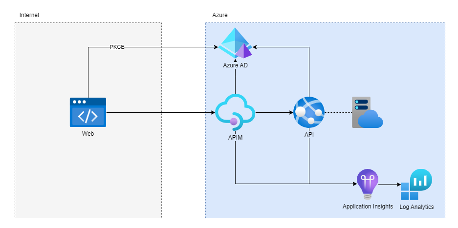
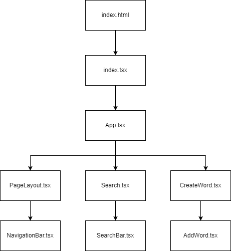

# Synonym Lookup

This application features the following public capabilities:
* Search for a word and get their synonyms.

With elevated permissions, you can also access these capabilities:
* Add a word with synonyms.

The project is built with the following main frameworks, languages, packages and patterns:
- Bicep: To define infrastructure as code.
- Github Actions: To define pipeline as code in YAML.
- .NET Core 7.0
- C#
- React
- Typescript
- API-first: using OpenAPI.yaml
- Material UI: NPM package
- Bootstrap: NPM package
- MSAL: Authentication Library from MS, used in both React application and API.
- PKCE: Proof Key for Code Exchange (https://oauth.net/2/pkce/)
- MediatR: Nuget package used to implement the Mediator pattern in the API.
- FluentValidation: Nuget package used to validate input model when creating a new word in the API.
- XUnit: Test framework for Unit- and Integration tests in the API.
- FluentAssertions: Nuget package used to create more readable assertions in tests.
- AZD CLI: https://learn.microsoft.com/en-us/azure/developer/azure-developer-cli/overview

## Infrastructure

The infrastructure in Azure that was used:
- Azure Static Web App
- API Management
- App Service
- App Service Plan
- Application Insights
- Log Analytics Workspace
- Azure AD

## .NET API

The API is built using .NET Core 7.0 and uses minimal APIs coupled with vertical slices architecture and the mediator pattern for loosely coupled dependencies.

Validation is done with FluentValidation on the input model when posting a new word.

Tests are written, both unit- and integrationtests.

Data is handled in-memory.

## React Web

The React Web application is mainly using Material UI with some parts from Bootstrap for styling, it uses MSAL for login and authentication against API. It is built with Typescript.

## API Management

API Management is setup through automation using Bicep together with Policies in XML files and an OpenAPI.yaml file to deploy the API to the API Management instance.

Something to note here is that there is an inbound policy which validates the JWT token when posting a new word. This will prevent unauthorized calls from reaching the backend server thus adding unnecessary load.

Policies, named values, API and logger is automatically setup via Bicep-, XML- and YAML files.